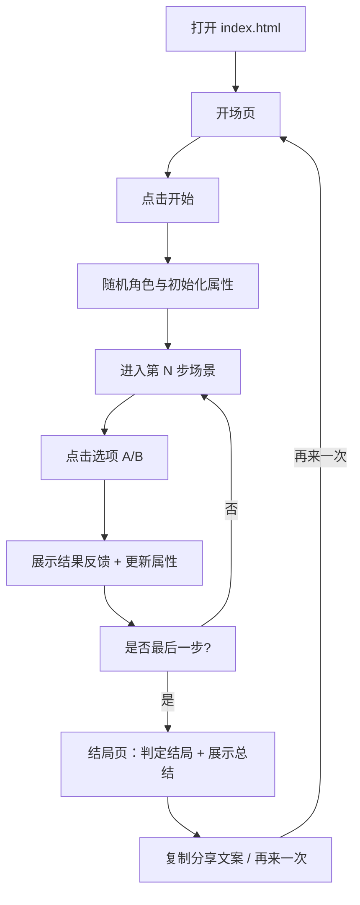

## 1. 产品概述
一款可直接离线打开运行的 HTML5 Canvas 互动作品《一分钟人生模拟》：玩家在 1 分钟左右完成一段“人生片段”，通过点击选项触发分支结果与结局总结。
- 目标用户：移动端浏览器用户、互动空间/轻应用平台用户
- 核心价值：节奏快、反差感强、可复玩，界面可爱卡通、反馈强

## 2. 核心功能

### 2.1 用户角色
| 角色 | 获取方式 | 核心权限 |
|------|----------|----------|
| 玩家 | 直接进入 | 选择选项、查看结果与结局、再次开始、保存最高纪录 |

### 2.2 功能模块
1. **开场页**：标题、开始按钮、离线说明
2. **选择页（主玩法）**：场景插画、角色插画、对话文本、两个选项按钮、即时结果反馈、进度显示
3. **结局页**：结局标题与描述、人生属性总结、分享文案复制、再次开始、最高纪录提示

### 2.3 页面详情
| 页面名称 | 模块名称 | 功能描述 |
|---------|----------|----------|
| 开场页 | 入口按钮 | 点击后进入角色/开局初始化 |
| 选择页 | 场景系统 | 每一步展示 1 个场景插画与对应对话；场景随剧情变化 |
| 选择页 | 角色系统 | 每局随机角色；角色拥有独立图案/形象与基础属性 |
| 选择页 | 选项系统 | 2 个可点击选项；点击后立即展示结果文本并更新属性 |
| 选择页 | 状态条 | 显示人生属性（如幸福/金钱/运气/能量等）与当前步数 |
| 结局页 | 结局判定 | 根据最终属性与历史选择命中结局；展示总结与分享文案 |
| 结局页 | 本地存储 | localStorage 存储“最高分/最稀有结局解锁数”等轻量数据 |

## 3. 核心流程
玩家体验流程（单局约 6–8 次点击）：
1) 进入开场页
2) 点击开始 → 随机角色 → 进入第 1 步场景
3) 每步阅读对话 → 点击选项 → 立刻得到结果反馈（文字 + 动效）→ 进入下一步
4) 最后一步结束 → 展示结局与属性总结 → 可复制分享文案/再来一次

## 4. 用户界面设计

### 4.1 设计风格
- 整体：可爱卡通、轻拟物卡片、暖色系；以“场景插画 + 角色插画 + 对话气泡”构成主要视觉
- 颜色：
  - 主色：奶油黄/蜜桃橙
  - 辅色：薄荷绿/天蓝
  - 中性色：墨蓝灰文字 + 米白背景
- 字体：优先使用系统中文字体栈，标题更粗更圆润（避免外部字体依赖）
- 按钮：圆角胶囊/软边矩形，带轻微阴影与按压反馈
- 动效：入场淡入、按钮按压、结果弹出、轻微粒子/闪光点缀（不依赖外部资源）
- 插画策略：
  - 角色图案：使用 Canvas 绘制“Q 版头像/半身”，每个角色不同配色与特征（如发型/配饰/表情）
  - 场景图片：使用 Canvas 绘制“卡通背景”（渐变天空、云朵、建筑/室内道具等），每个场景有独立元素组合

### 4.2 页面设计概览
| 页面名称 | 模块名称 | UI 元素 |
|---------|----------|---------|
| 开场页 | 标题区 | 大标题 + 副标题 + 轻动效背景 |
| 选择页 | 画布舞台 | 场景插画（上半）+ 对话气泡（中部）+ 角色图案（边角/下方） |
| 选择页 | 互动区 | 2 个大按钮（适配拇指点击）；点击后出现结果提示条 |
| 结局页 | 总结卡 | 结局标题/描述 + 属性条 + 分享文案框 + 按钮组 |

### 4.3 响应式与移动端适配
- 默认以竖屏为主进行布局与视觉构图
- 画布采用等比缩放与安全边距（safe-area / viewport-fit=cover），确保任意主流手机上不出现横向滚动条
- 横屏时自动缩放与居中，保证内容可完整显示（必要时上下留白）

## 5. 技术与合规约束（必须满足）
- 交付形态：优先单文件 index.html（所有代码与资源内联），确保“纯离线可运行”
- 无网络请求：禁止 fetch / XMLHttpRequest / WebSocket / 第三方请求库
- 无外部资源：不使用任何 CDN、外链图片/字体/音频；插画与音效尽量使用 Canvas 与 WebAudio 生成
- 无外部跳转：不使用 <a> 外链与 window.location 外跳
- 体积：zip 后总体积 < 8MB（优先使用程序化绘制与合成音效）
- 数据存储：如需最高纪录，使用 localStorage
- 错误处理：必须使用 try-catch 捕获潜在异常，并在页面上显示“哎呀，出错了，请重启试试吧~”
- 内容合规：不包含违法违规、IP 侵权、不利于未成年人的内容
