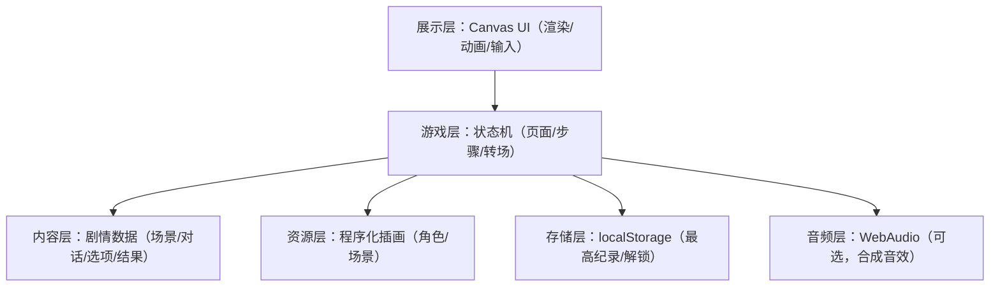

## 1. 架构设计

## 2. 技术说明
- 前端：原生 HTML + CSS + JavaScript（ES2020+）
- 渲染：HTML5 Canvas 2D（单画布 + Offscreen/离屏缓存）
- 动画：requestAnimationFrame + 自定义补间（轻量）
- 输入：Pointer Events（兼容触摸与鼠标）
- 存储：localStorage（小数据）
- 后端：无
- 外部服务：无

## 3. 路由定义
| 路由 | 用途 |
|------|------|
| /index.html | 单页应用入口，包含 Canvas 与全部逻辑 |

## 4. 数据设计

### 4.1 核心状态
- view：start / play / ending / error
- stepIndex：当前步数
- role：当前角色（id、显示名、外观主题、初始属性）
- stats：属性对象（0–100），用于结局判定与反馈
- scene：当前场景（背景主题、对话文本、选项列表）
- history：选择记录（用于结局文案与回放）
- bestRecord：最高纪录/解锁（localStorage）

### 4.2 内容数据结构（建议）
- roles：角色数组
  - id, name, themeColors, portraitSpec, baseStats
- scenes：场景数组（或按章节组织）
  - id, bgSpec, dialogue, choices[]
  - choices[]：text, resultText, statDelta, nextSceneId（可选）
- endings：结局数组
  - id, title, desc, test(stats, history)

## 5. 关键实现策略
- 程序化插画：
  - 角色与场景全部使用 Canvas 画笔绘制（形状、渐变、描边、阴影），保证离线与体积
  - 角色图案使用离屏缓存生成，避免每帧重复绘制
- 性能优化：
  - 固定逻辑分辨率（例如 750×1334）并按设备缩放
  - 只在需要时重绘（状态变化/动画帧）
  - 文本渲染使用分段换行缓存，减少重复测量
- 适配与安全区：
  - viewport-fit=cover + CSS env(safe-area-inset-*) 处理刘海屏
  - 横竖屏变化时重新计算画布尺寸与缩放
- 可靠性：
  - 全局 try-catch 包裹主初始化与主循环关键路径
  - 捕获错误后切换到 error view 并显示“哎呀，出错了，请重启试试吧~”

## 6. 合规与约束落实清单
- 不引入任何网络请求 API（fetch / XHR / WebSocket）
- 不引用任何外部 CDN、外链图片/字体/音频
- 不提供外部跳转能力（不使用 <a> 外链、window.location）
- 项目可直接离线打开运行，建议以单文件形式交付
